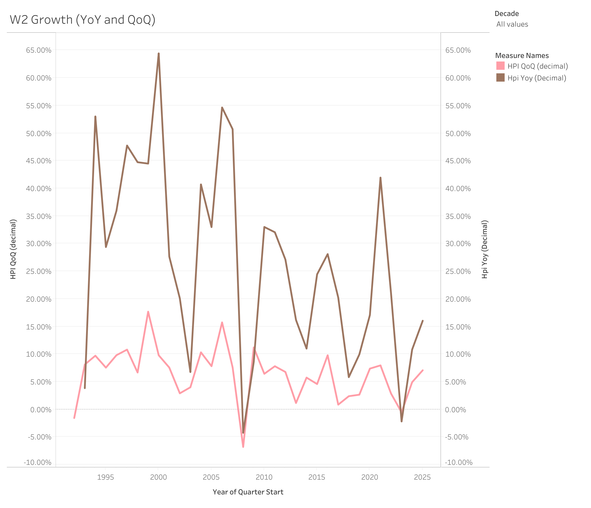
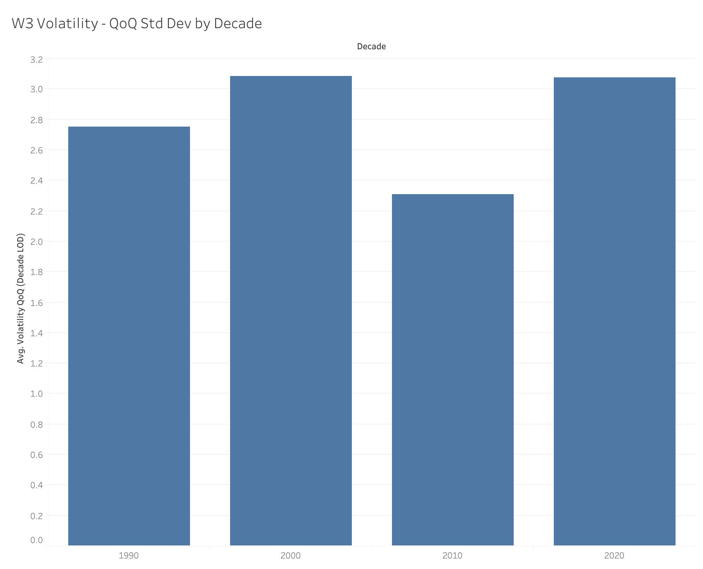
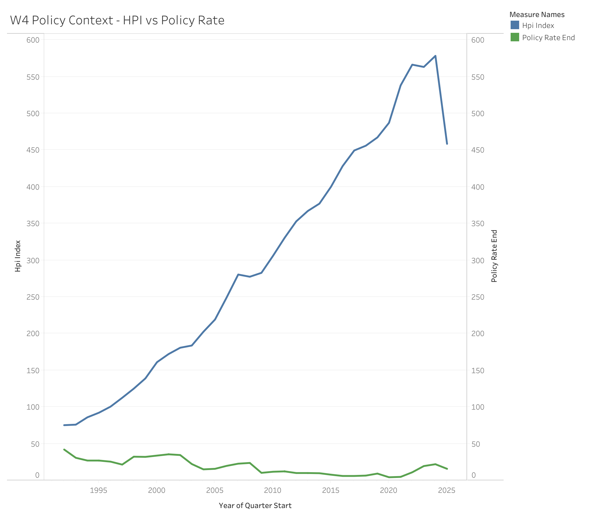

D1_executive_overview.png

# Norway Housing Pressure Tracker (1992–present)

A reproducible analytics pipeline and reviewer-ready deliverables to track Norwegian housing price dynamics over time:
trend (HPI level), growth regimes (YoY/QoQ), volatility regimes (QoQ variability by decade), and policy context (HPI vs Norges Bank policy rate).

## Business question
How have housing price growth and volatility evolved since 1992, and how do they relate to monetary policy context over time?

## Key findings

Quarterly data, 1992Q1–2025Q3 (135 quarters), combining SSB's housing price index (HPI) with the Norges Bank policy rate. Descriptive — patterns, not causes.

- **Strong but uneven growth.** HPI grew 6.7% year-over-year on average, ranging from +21.2% (2000Q1 boom) to −6.9% (2008Q4 financial crisis). The steepest single-quarter fall was also 2008Q4, at −7.0% QoQ.

- **Growth has decelerated decade by decade.** Average YoY growth fell 9.3% (1990s) → 7.6% (2000s) → 5.2% (2010s) → 4.6% (2020s).

**Interactive dashboards:** [Tableau Public](https://public.tableau.com/app/profile/babak.balouch5382/viz/norway_housing_pressure_part4/D1ExecutiveOverview)

- **The 2010s were the calmest decade.** Average QoQ volatility (std dev): 2.8% (1990s), 3.1% (2000s), 2.3% (2010s), 3.1% (2020s) — the 2000s and 2020s were the most turbulent.

- **Rates fell as prices climbed.** The average end-of-quarter policy rate dropped from 7.4% (1990s) to 2.2% (2010s), then rose to ~3.4% (2020s); across the period the rate spanned 1.0%–11.0% while HPI trended steadily upward.

- **Latest quarter (2025Q3) — mixed signals.** HPI YoY +5.0% but QoQ −0.78%, with the policy rate at 5.0%: positive annual growth alongside negative quarterly momentum points to short-term cooling.

## Deliverables (open these first)

- Tableau dashboard exports (PNG): `tableau/exports/`
  - `tableau/exports/D1_executive_overview.png`
  - `tableau/exports/D2_growth.png`
  - `tableau/exports/D3_volatility.png`
  - `tableau/exports/D4_policy_context.png`
- Tableau workbook (Part 4): `tableau/norway_housing_pressure_part4.twb` / `tableau/norway_housing_pressure_part4.twbx`
- Excel workbook (Part 3): `excel/norway_housing_presure_part3.xlsx`
- SQL mart + validation + EDA scripts: `sql/`
- Run order / reproducibility: `docs/reproduce_project.md`
- Deliverables map: `docs/deliverables_index.md`
- Data dictionary: `docs/data_dictionary.md`
- Validation metadata: `docs/metadata_part1.json`, `docs/metadata_part2.json`
- Data sources notes: `docs/data_sources.md`

## Report
- Full case study report (DOCX): [Norway Housing Pressure Tracker Report](docs/Norway_Housing_Pressure_Tracker_Report.docx)

## How to reproduce
Follow the single run-order document:
- `docs/reproduce_project.md`

High-level sequence:
1. `python src/01_download_raw.py`
2. `python src/02_transform_clean.py --run all --tag <TAG>`
3. `python -u src/03_run_duckdb_sql.py --run-validation --run-eda`

## Repo structure
- `src/` — Python pipeline scripts
- `sql/` — DuckDB SQL mart, validation checks, EDA queries
- `excel/` — Excel deliverable (tracked)
- `tableau/` — Tableau workbook + dashboard exports (tracked)
- `docs/` — metadata, notes, data dictionary, navigation docs
- `data/raw/`, `data/processed/` — generated outputs (intentionally not committed)

## Limitations (current project state)
- CPI is annual and repeated quarterly; “real_*” metrics are proxies.
- CPI missing for 2025Q1–2025Q3.
- Mart currently includes one `boligtype_code` (no boligtype slicer).
- Tableau export workflow limitations are documented in `docs/tableau_part4_notes.md`.
